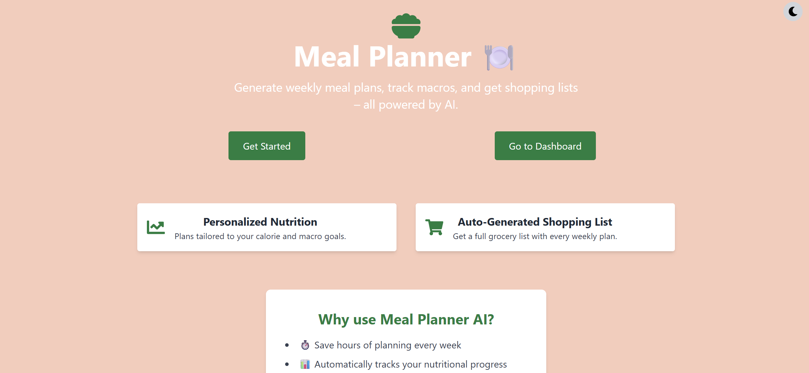
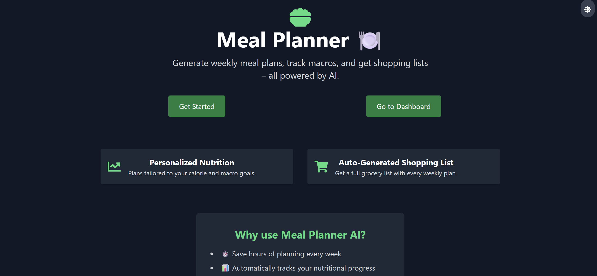
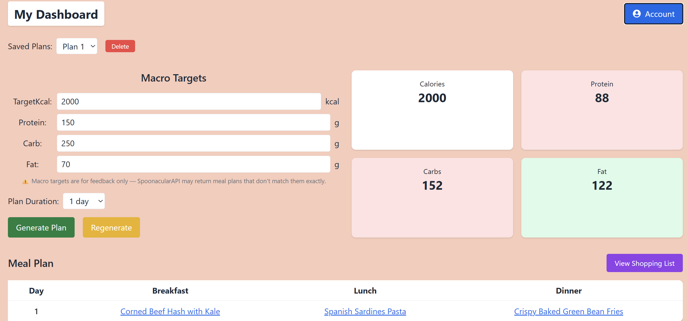
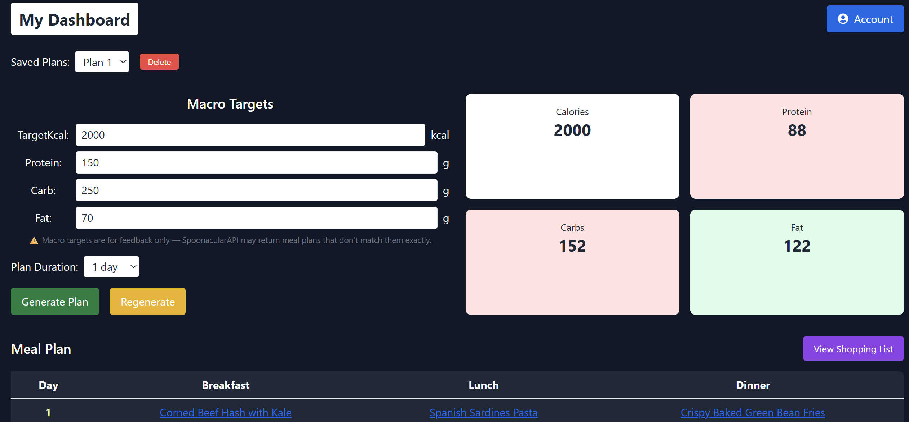
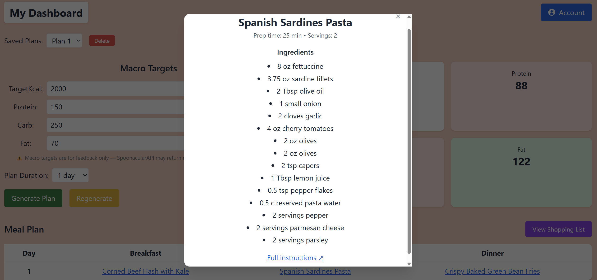
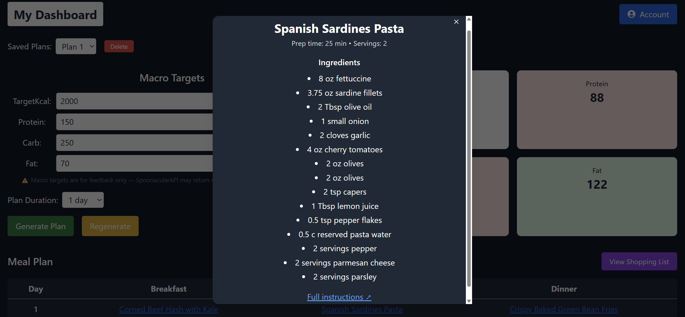
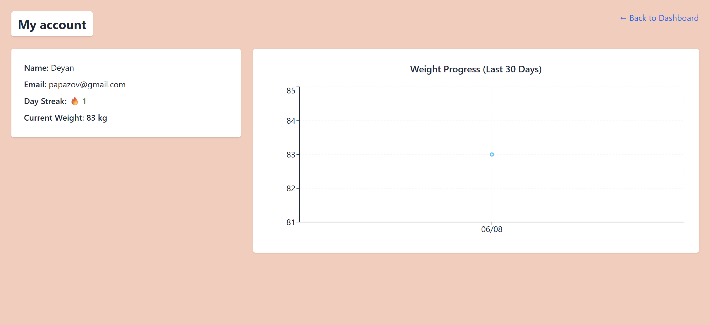
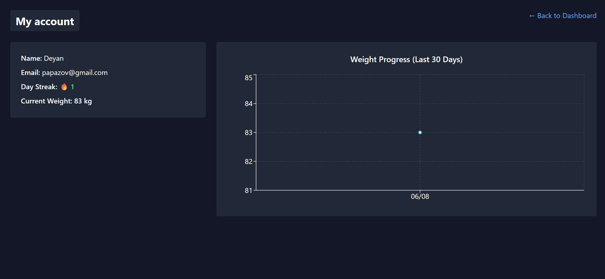

# Meal Planner

**Author:** Deyan Papazov  
**GitHub:** [@DeyanPPapazov](https://github.com/DeyanPPapazov)  
**LinkedIn:** [linkedin.com/in/deyan-papazov](https://www.linkedin.com/in/deyan-papazov)

Weekly meal-planning, automatic shopping lists, weight tracking with streak badges, and a modern dark-mode UI — all in one full-stack web application.

---

## Table of Contents
1. Project Overview
2. Features
3. Tech Stack
4. Getting Started  
   4.1 Docker-First (recommended)  
   4.2 Manual Dev Workflow (optional)
5. Environment Variables
6. Screenshots
7. Contact

---

## 1  Project Overview
*Meal Planner* lets users:

* Set calorie & macro goals
* Generate 1- / 7-day meal plans via Spoonacular
* Auto-build a consolidated shopping list
* Log daily weight and unlock streak achievements

Backend → Spring Boot + PostgreSQL + JOOQ  
Frontend → React 18 / Vite + Tailwind

---

## 2  Features

| Domain              | Highlights                                                               |
|---------------------|--------------------------------------------------------------------------|
| **Meal Planning**   | Highly-nutritional meals, regenerate per slot (Breakfast / Lunch / Dinner) |
| **Shopping List**   | One click → all ingredients for the week                                 |
| **Weight Tracking** | Daily log, streak counter, badge toasts                                  |
| **Auth**            | JWT access + refresh, secure hashing                                     |
| **UX**              | Responsive dark-mode, toast feedback                   |

---

## 3  Tech Stack

| Layer       | Main Tech                                               |
|-------------|---------------------------------------------------------|
| Backend     | Java 17 · Spring Boot 3 · PostgreSQL 15 · JOOQ · Flyway |
| Frontend    | React 18 (Vite) · TailwindCSS · Headless UI             |
| Integrations| Spoonacular API                                         |
| Build/Dev   | Docker & Docker Compose · Gradle 8 · npm 10             |

---

## 4  Getting Started

### 4.1  Docker-First  (recommended)

> **Prerequisite:** Docker Desktop with Compose v2 (macOS / Windows / Linux)

#### 1.Clone & enter the project
```bash
git clone https://github.com/DeyanPPapazov/meal-planner.git
cd meal-planner
```
#### 2.Add secrets - SPOONACULAR_KEY
```bash
cp .env.example .env
```
Then edit SPOONACULAR_KEY with your personal one which you can get at https://spoonacular.com/food-api.

#### 3.Build everything & start the full stack
```bash
./build-backend.sh
```

| Service      | URL                                                                            |
| ------------ | ------------------------------------------------------------------------------ |
| Front-end    | [http://localhost:5173](http://localhost:5173)                                 |
| API (health) | [http://localhost:8080/actuator/health](http://localhost:8080/actuator/health) |

### 4.2  Manual Dev Workflow (optional)

> **Only** if you really don’t want to use Docker.

### 1. **Install PostgreSQL 15**  
   Create a database named `mealplanner` with user `postgres` / password `postgres`
   ```sql
   CREATE DATABASE mealplanner;
   ```

---

### 2. Run the backend

From the project root:

```bash
cd backend
./gradlew flywayMigrate generateJooq bootRun
```

This will apply Flyway migrations, generate JOOQ classes, and start the Spring Boot API on `http://localhost:8080`.

---

### 3. Run the frontend

In a separate terminal:

```bash
cd frontend
npm install
npm run dev -- --host 0.0.0.0
```

This starts the Vite-powered React app on `http://localhost:5173`.

---

### 4. Access the app

- Front-end: [http://localhost:5173](http://localhost:5173)
- API health: [http://localhost:8080/actuator/health](http://localhost:8080/actuator/health)

---

## 5 Screenshots

### Homepage – Light vs Dark Mode




### Dashboard – Light vs Dark Mode




### Recipe Modal – Light vs Dark Mode




### 📊 Account – Light vs Dark Mode



## Contact

Made by *Deyan P. Papazov*  
Email: deyanpapazov@gmail.com  
LinkedIn: [https://www.linkedin.com/in/deyanpapazov](https://www.linkedin.com/in/deyan-papazov)

### Notes

Testing support is planned and will be added soon to ensure reliability and maintainability across the application.
